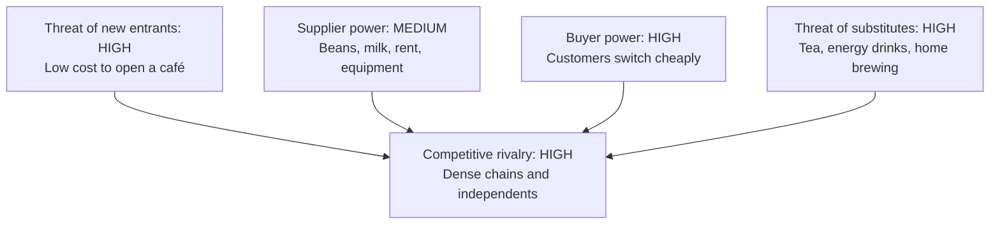

```mermaid
flowchart TB
  NE["Threat of new entrants: HIGH<br/>Low cost to open a café"]
  SUP["Supplier power: MEDIUM<br/>Beans, milk, rent, equipment"]
  BUY["Buyer power: HIGH<br/>Customers switch cheaply"]
  SUB["Threat of substitutes: HIGH<br/>Tea, energy drinks, home brewing"]
  RIV["Competitive rivalry: HIGH<br/>Dense chains and independents"]
  NE --> RIV
  SUP --> RIV
  BUY --> RIV
  SUB --> RIV
```

Ratings are typical for a coffee chain. Re-rate them with your city's café density and bean-price data.

Skipped: market-specific figures. Risk: the ratings are generic, not from your numbers.