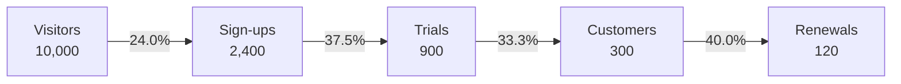

```mermaid
flowchart LR
    V["Visitors<br/>10,000"] -->|"24.0%"| S["Sign-ups<br/>2,400"]
    S -->|"37.5%"| T["Trials<br/>900"]
    T -->|"33.3%"| C["Customers<br/>300"]
    C -->|"40.0%"| R["Renewals<br/>120"]
```

Visitor to customer: 3.0%. Visitor to renewal: 1.2%.

Largest loss: visitor to sign-up, 76% of visitors leave.