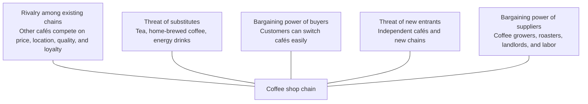

Porter’s five forces show how competition around a coffee shop chain affects its ability to earn profits.

```mermaid
flowchart TB
    R["Rivalry among existing chains<br/>Other cafés compete on price, location, quality, and loyalty"]
    S["Threat of substitutes<br/>Tea, home-brewed coffee, energy drinks"]
    B["Bargaining power of buyers<br/>Customers can switch cafés easily"]
    C["Coffee shop chain"]
    N["Threat of new entrants<br/>Independent cafés and new chains"]
    U["Bargaining power of suppliers<br/>Coffee growers, roasters, landlords, and labor"]

    R --- C
    S --- C
    B --- C
    N --- C
    U --- C
```

