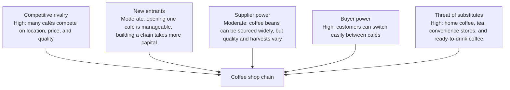

Porter’s five forces for a coffee shop chain:

```mermaid
flowchart TB
    C["Coffee shop chain"]
    R["Competitive rivalry<br/>High: many cafés compete on location, price, and quality"]
    N["New entrants<br/>Moderate: opening one café is manageable; building a chain takes more capital"]
    S["Supplier power<br/>Moderate: coffee beans can be sourced widely, but quality and harvests vary"]
    B["Buyer power<br/>High: customers can switch easily between cafés"]
    T["Threat of substitutes<br/>High: home coffee, tea, convenience stores, and ready-to-drink coffee"]

    R --> C
    N --> C
    S --> C
    B --> C
    T --> C
```

