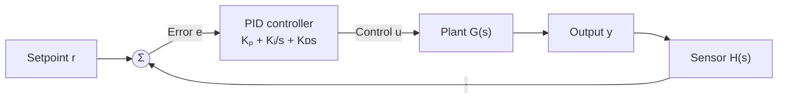

A PID loop compares the setpoint with the measured output, then uses the error to adjust the plant.

```mermaid
flowchart LR
    r["Setpoint r"] --> sum(("Σ"))
    sum -->|"Error e"| pid["PID controller<br/>Kₚ + Kᵢ/s + Kᴅs"]
    pid -->|"Control u"| plant["Plant G(s)"]
    plant --> y["Output y"]
    y --> sensor["Sensor H(s)"]
    sensor -->|"-"| sum
```

