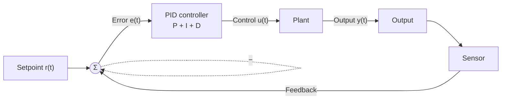

```mermaid
flowchart LR
    R["Setpoint r(t)"] --> SUM((Σ))
    SUM -->|"Error e(t)"| PID["PID controller<br/>P + I + D"]
    PID -->|"Control u(t)"| PLANT["Plant"]
    PLANT -->|"Output y(t)"| Y["Output"]
    Y --> FB["Sensor"]
    FB -->|"Feedback"| SUM
    SUM -. "−" .-> SUM
```

