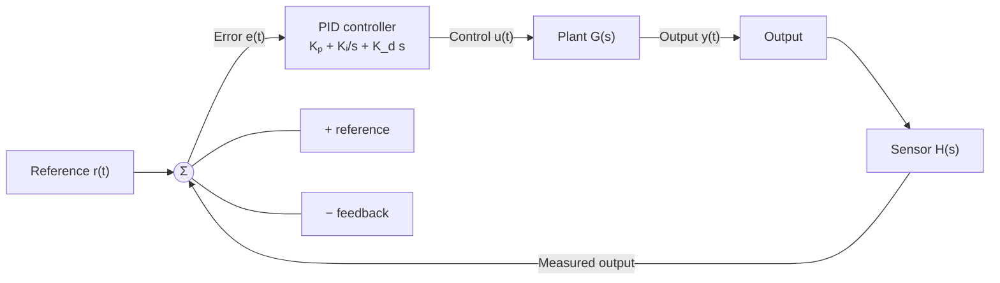

A PID loop compares the reference with the measured output, then uses proportional, integral, and derivative action to drive the error toward zero.

```mermaid
flowchart LR
    R["Reference r(t)"] --> SUM(("Σ"))
    SUM -->|"Error e(t)"| PID["PID controller<br/>Kₚ + Kᵢ/s + K_d s"]
    PID -->|"Control u(t)"| PLANT["Plant G(s)"]
    PLANT -->|"Output y(t)"| Y["Output"]
    Y --> SENSOR["Sensor H(s)"]
    SENSOR -->|"Measured output"| SUM
    SUM --- PLUS["+ reference"]
    SUM --- MINUS["− feedback"]
```

